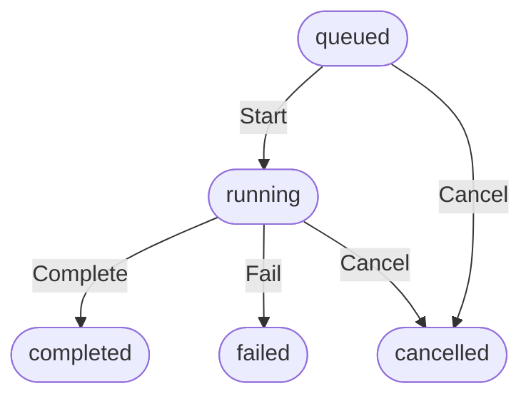

# Core Job Abstraction Design & Implementation Plan

## 1. Overview & Architecture

Feature 1 establishes the foundational, clean, and independent **Core Job Abstraction** for Askito in `internal/job`. This package provides core lifecycle management for asynchronous operations without coupling to HTTP handlers, persistence layers, progress reporting, or domain-specific logic.

## 2. Package Path & Structure

- **Package Path**: `internal/job`
- **Files**:
  - `internal/job/model.go`: Defines `JobType`, `JobStatus`, `Job` struct, and error definitions.
  - `internal/job/manager.go`: Defines `JobManager` with thread-safe in-memory map storage, creation, snapshot reads, and lifecycle transitions.
  - `internal/job/job_test.go`: Comprehensive unit tests covering state machine transitions, edge cases, and concurrency safety.

## 3. Data Models & Types

### Job Status
```go
type JobStatus string

const (
	StatusQueued    JobStatus = "queued"
	StatusRunning   JobStatus = "running"
	StatusCompleted JobStatus = "completed"
	StatusFailed    JobStatus = "failed"
	StatusCancelled JobStatus = "cancelled"
)

func (s JobStatus) IsTerminal() bool {
	return s == StatusCompleted || s == StatusFailed || s == StatusCancelled
}
```

### Job Type
```go
type JobType string

const (
	JobTypeExport     JobType = "export"
	JobTypeSubtitle   JobType = "subtitle"
	JobTypeTranscript JobType = "transcript"
)
```

### Job Struct
```go
type Job struct {
	ID         string     `json:"id"`
	Type       JobType    `json:"type"`
	Status     JobStatus  `json:"status"`
	CreatedAt  time.Time  `json:"created_at"`
	StartedAt  *time.Time `json:"started_at,omitempty"`
	FinishedAt *time.Time `json:"finished_at,omitempty"`
	Error      string     `json:"error,omitempty"`
}
```

## 4. State Machine & Lifecycle Rules

Valid state transitions:
- `queued` -> `running` (Sets `StartedAt = time.Now().UTC()`)
- `queued` -> `cancelled` (Sets `FinishedAt = time.Now().UTC()`)
- `running` -> `completed` (Sets `FinishedAt = time.Now().UTC()`)
- `running` -> `failed` (Sets `FinishedAt = time.Now().UTC()`, records error message)
- `running` -> `cancelled` (Sets `FinishedAt = time.Now().UTC()`)

Rules & Constraints:
1. Terminal states (`completed`, `failed`, `cancelled`) cannot transition further.
2. Invalid jumps (e.g., `queued` -> `completed`, `completed` -> `running`) must be strictly rejected with sentinel errors (e.g., `ErrInvalidTransition`).
3. Timestamps must be in UTC (`time.Now().UTC()`) and must not be overwritten incorrectly on subsequent invalid transition attempts.



## 5. JobManager Concurrency Strategy

`JobManager` manages jobs in memory using a mutex-protected map:

```go
type JobManager struct {
	mu   sync.RWMutex
	jobs map[string]Job
}

func NewManager() *JobManager {
	return &JobManager{
		jobs: make(map[string]Job),
	}
}
```

Operations:
1. **Create(jobType JobType) (*Job, error)**: Generates a new UUID string via `google/uuid`, initializes `CreatedAt` in UTC, sets status to `queued`, stores in map under lock, and returns a deep copy/snapshot.
2. **Get(id string) (Job, error)**: Acquires read lock (or write lock for safety/consistency), checks existence, and returns a copy/snapshot of the `Job` struct to prevent data races when callers inspect fields concurrently.
3. **Transition(id string, targetStatus JobStatus, jobErr error) (Job, error)**: Acquires write lock, validates state transition rules, updates status, timestamps (`StartedAt` / `FinishedAt`), records error string if failed, and returns the updated job copy.

## 6. Unit Test Strategy

- **TestJobCreation**: Validates unique ID generation, initial status (`queued`), and correct `CreatedAt` timestamp.
- **TestJobStateTransitions**:
  - Tests all valid transition paths (`queued` -> `running` -> `completed`/`failed`/`cancelled`, `queued` -> `cancelled`).
  - Tests all invalid transition paths (e.g., `queued` -> `completed`, terminal -> any) ensuring `ErrInvalidTransition` is returned.
  - Verifies timestamp population (`StartedAt`, `FinishedAt`) and error message recording.
- **TestJobManagerConcurrency**:
  - Spawns multiple goroutines concurrently creating jobs, reading snapshots via `Get`, and racing state transitions.
  - Run with `-race` flag to guarantee zero race conditions.

## 7. Acceptance Criteria

- Package `internal/job` compiles cleanly with zero external domain dependencies (no YouTube, HTTP handlers, progress, context, persistence).
- All state transition rules enforced strictly with explicit errors.
- `JobManager` provides safe concurrent operations with snapshot returns.
- Full unit test coverage passing successfully under race detector.
